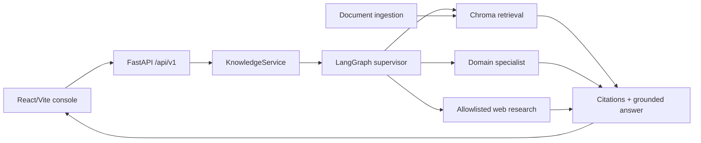

# Architecture Notes

Axiom Tech V3 is a modular monolith with explicit integration seams. The employee console calls a versioned FastAPI boundary. The backend composes a real LangGraph workflow, a persistent ChromaDB adapter by default, optional Pinecone/NVIDIA integrations, and a fail-closed web research branch.

## System Architecture Overview

## Architectural Layers

- **HTTP adapter:** `app/api.py`, `app/schemas.py`, and `app/main.py` expose health, status, query, and ingestion contracts.
- **Application service:** `app/service.py` coordinates ingestion, retrieval, graph execution, and response mapping.
- **Agent workflow:** `app/graph.py` and `app/agents/` implement supervisor routing, specialist work, grading, bounded rewrite, synthesis, and explicit web routing.
- **Ports and adapters:** `app/vectorstore/` isolates ChromaDB, deterministic embeddings, memory fallback, and Pinecone; `app/llm_client.py` isolates NVIDIA NIM.
- **Presentation:** `frontend/src/` provides the typed React employee experience.

## Detected Design Patterns

| Pattern | Location | Purpose |
| --- | --- | --- |
| Ports and adapters | `app/vectorstore/port.py`, `factory.py` | Swap vector providers without changing graph logic. |
| Factory | `app/vectorstore/factory.py` | Select Chroma, Pinecone, or memory from configuration. |
| Supervisor/router | `app/graph.py`, `app/agents/supervisor.py` | Select the domain specialist and keep web research explicit. |
| Strategy | `app/llm_client.py`, `app/agents/web_research.py` | Use deterministic/local or hosted providers behind stable contracts. |

## Entry Points

- [FastAPI application](../../app/main.py)
- [Graph orchestration](../../app/graph.py)
- [Knowledge service](../../app/service.py)
- [Frontend shell](../../frontend/src/App.tsx)
- [Docker Compose](../../docker-compose.yml)

## First cloud deployment

The initial OCI target is a Compute VM running the API and frontend Compose services. ChromaDB is mounted at `/data/chroma` from durable OCI storage. OCI Vault supplies runtime provider and observability secrets; the deployment does not bake credentials into images. OCI Container Registry and a load balancer are follow-up hardening steps rather than prerequisites for the first challenge proof.

LangGraph automatically participates in LangSmith tracing when the `LANGSMITH_*` runtime configuration is enabled. The NVIDIA-compatible client is wrapped for a nested provider span. Inputs and outputs are hidden by default and the API exposes only sanitized observability status.

## External Service Dependencies

- ChromaDB persists locally under `.axiom_chroma/` and is the default runtime.
- Pinecone is optional and must be configured before it is reported as active.
- NVIDIA NIM is optional; deterministic synthesis remains available without credentials.
- LangSmith is optional; tracing remains disabled without explicit runtime configuration.
- OCI Compute, Block Volume, and Vault are deployment boundaries; they are not active until an operator provisions them.
- Serper/web fetching is opt-in, restricted to an HTTPS hostname allowlist, and returns URL citations only.

## Key Decisions and Risks

See [ADR 003](../../docs/adr/003-chromadb-first.md), [ADR 004](../../docs/adr/004-real-langgraph-workflow.md), and [ADR 005](../../docs/adr/005-fastapi-boundary.md). The primary risk is evidence quality: internal answers must remain grounded and web research must never become an implicit hallucination fallback.
